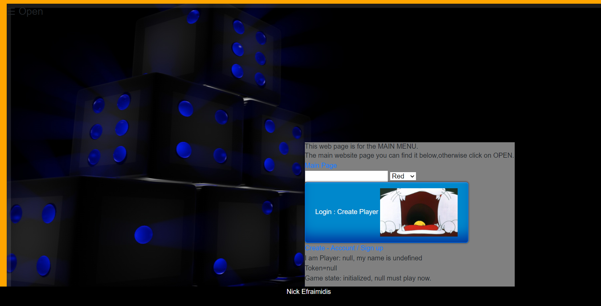

# Feyga
# ADISE20_nickefr

Περιγραφή στο users

-https://  Create Player Account

--Δημιούργησα μία ιστοσελίδα Html, όπου κάνει ο παίκτης  ένα  απλό login.Τα δεδομένα που δίνει περνάνε στην βάση με όνομα users, για να συνδεθεί/ούν στην συνέχεια  δημιουργεί έναν παίκτη (με πιόνια B ή R)

-https://login.php 

--Ο χρήστης συνδέετε στην https://players.php όπου δίνει σε πια ομάδα θα είναι R ή Β

-Ο χρήστης μπορεί να κάνει login username και password και τα στοιχεία αυτά να αποθηκεύονται στην βάση του user,database:backgammone,table name:users. 

-Η  ιστοσελίδα  index.php περιλαμβάνει ένα τον κώδικα του παιχνιδιού και display την βάση του / το ίδιο και σε local.

-Ανάλογα με την ομάδα κατευθύνεται και στο αντίστοιχο index.

-Ο χρήστης μπορεί μέσο indexr.php να κάνει τα στάδια 1 εώς 3. (Αν έχει κάνει σύνδεση από την ομάδα B αντίστοιχα συνδέεται και στο indexb.php και εκτελεί τα στάδια 1 εώς 3. 
Στάδιο 1: αναγνώριση παίκτη που θα παίξει πρώτος 
Στάδιο 2: Ο παίκτης ανάλογα με το αν παίζει πρώτος και τι χρώμα είναι κάνει τις κινήσεις του(Επιτρέπεται μόνο 2 φορές να κουνήσει κάθε πιόνι).*
Στάδιο 3: Scoreboard 
 
*Eπειδή είναι 15 πιόνια ξεκινάω  τις κινήσεις με 2 πιόνια από την κάθε πλευρά,να μπορούν να κάνουν ΜΟΝΟ 2 κινήσεις το κάθε ένα,διαφορετικά αν είχα παραπάνω από 2 πιόνια, θα είχα υπήρχαν παραπάνω κινήσεις.Σύμφωνα με τους κανόνες δεν μπορώ να μετακινώ παραπάνω από 2 πιόνια,εκτός των περιπτώσεων 1χ1 ,2χ2,3χ3,4χ4,5χ5,6χ6.

---------------------------------------------------------------------Αναλυτικά-----------------------------------------------------------------------------------
-Χρησιμοποιώ gifs αντί για εικόνες στον κώδικα (στις περισσοτερες φορές).
-Δεν μπορεί να γίνει η χρήση του photobox στον server,σαν localhost -client side είναι ως εξής:



-Διαδικασία : Welcome Page                                                                                     - welcome.html
-Ο χρήστης μέσο του Create Player εισέρχεται στην Αρχική σελίδα και δημιουργεί τον παίκτη                      -arxikiselida.html
-Επιλέγει όνομα,χρώμα και create character{button}                                                             - Player{B\R}  | token
-Sign Up page & Login Page -δίνει όνομα και κωδικό με περιορισμούς                                             -login.php
-Game Page -Δυνατότητα του χρήστη να δίνει το όνομα που επέλεξε κατά την δημιουργία,χρώμα,token                -index.php
-Πίνακας 2χ12                                                                                                  -backgammone(δημιουργήθηκε με javascript  και τα στοιχεία του κάθε -cell έχουν                                                                                                                      οριστεί στην βάση μου )
-Περιλαμβάνει -Κανόνες παιχνιδιού                                                                              -photobox 

-1ο στάδιο :Αρχικοποίηση παιχνιδιού κάθε παίκτης πρέπει να φθάσει την περιοχή του άλλου με 1 πιόνι-κινήσεις
-13-νέο board                                                                                                  -Javascript
-2ο στάδιο :Αποθηκεύω την μεταβλητή {B} ή {R} -ανάλογα με τον νικητή στην βάση μου.                            -workbench sto users
-3ο στάδιο δημιουργώ νέο board -τελικό στάδιο παιχνιδιού      


Table of Contents
=================
   * [Εγκατάσταση](#εγκατάσταση)
      * [Απαιτήσεις](#απαιτήσεις)
      * [Οδηγίες Εγκατάστασης](#οδηγίες-εγκατάστασης)
   * [Περιγραφή API](#περιγραφή-api)
      * [Methods](#methods)
         * [Board](#board)
            * [Ανάγνωση Board](#ανάγνωση-board)
            * [Αρχικοποίηση Board](#αρχικοποίηση-board)
         * [Piece](#piece)
            * [Ανάγνωση Θέσης/Πιονιού](#ανάγνωση-θέσηςπιονιού)
            * [Μεταβολή Θέσης Πιονιού](#μεταβολή-θέσης-πιονιού)
         * [Player](#player)
            * [Ανάγνωση στοιχείων παίκτη](#ανάγνωση-στοιχείων-παίκτη)
            * [Καθορισμός στοιχείων παίκτη](#καθορισμός-στοιχείων-παίκτη)
         * [Status](#backgammon)
            * [Ανάγνωση κατάστασης παιχνιδιού](#ανάγνωση-κατάστασης-παιχνιδιού)
      * [Entities](#entities)
         * [Board](#board-1)
         * [Players](#players)
         * [Game_status](#backgammon)


# Demo Page

Μπορείτε να κατεβάσετε τοπικά ή να επισκευτείτε την σελίδα: 
https:welcome.html


# Εγκατάσταση

## Απαιτήσεις

* Apache2
* Mysql Server
* php

## Οδηγίες Εγκατάστασης

 * Κάντε clone το project σε κάποιον φάκελο <br/>
  $ git clone https://github.com/nickefr/Feyga.git

 * Βεβαιωθείτε ότι ο φάκελος είναι προσβάσιμος από τον Apache Server. πιθανόν να χρειαστεί να καθορίσετε τις παρακάτω ρυθμίσεις.

 * Θα πρέπει να δημιουργήσετε στην Mysql την βάση με όνομα 'adise19_chess5' και να φορτώσετε σε αυτήν την βάση τα δεδομένα από το αρχείο DB/schema5.sql

 * Θα πρέπει να φτιάξετε το αρχείο lib/config_local.php το οποίο να περιέχει:
```
    <?php
	$DB_PASS = 'κωδικός';
	$DB_USER = 'όνομα χρήστη';
    ?>
```

# Περιγραφή Παιχνιδιού

Η Φεύγα  παίζεται ως εξής: 2 παίκτες έχουν ο κάθε ένας τους  στις διαγώνιες ακριανές θέσεις την αφετηρία τους.Ορίζονται ο κάθε ένας παίκτης με διαφορετικό χρώμα.Στην προκειμένη περίπτωση διάλεξα κόκκινα και μαύρα πούλια. Ένας παίκτης έχει και τα αντίστοιχα πιόνια. Τα κόκκινα πιόνια ειναι 15 και τα μαύρα επίσης 15.

Οι κανόνες είναι  
1)a) Παίζουν 4 πιόνια στην αρχή(2 Μαύρα - 2 Κόκκινα).Σκοπός είναι ξεκινώντας από την αφετηρία τους ,να φθάσουν στου αντιπάλου την μεριά πρώτα.Αυτό σημαίνει ότι θα πρέπει να με 2 ζαριές για τα κάθε 2 ζευγάρια ζαριών να ξεπεράσουν την αντίστοιχη θέση 12.Αυτά είναι στην "1ή" θέση-αφετηρία τους και πρέπει να πάνε στην "13"(τα μαύρα πχ ξεκινάνε από την 24 γιατί ειναι η αφετηρία τους και πρέπει να πάνε σε μικρότερη θέση .Τα ζαριά φθάσουν πρώτα ξεκινάνε να παίζουν πρώτα.Έχει δημιουργηθεί ένα board όπου οι 2 χρήστες πατάνε ένα κουμπί και οι ζαριές είναι 4. 2 για τα μαύρα και 2 για τα κόκκινα. Μας δείχνει ποιός από τους δύο κέρδιζει. Υπάρχει επιλογή ποιός κέρδισε και την διαλέγουμε,σε περίπτωση λάθους μας βγάζει αντίστοιχο μήνυμα,όπως εξίσου μας βγάζει και το κατάλληλο μήνυμα αν όντως κερδίζουν πχ τα κόκκινα.Προχωρόντας ο παίκτης κατευθύνεται στο δεύτερο στάδιο όπου πρέπει να μεταφέρει τα 2 πιόνια στις ανάλογες θέσεις.Ανάλογα με το ποιός παίκτης είναι κατευθύνετε και στην σελίδα που του αντιστοιχεί.Ο χρόνος του είναι περιορισμένος.Σε περίπτωση που ο χρήστης δεν παίξει το παιχνίδι γίνετε GAMEOVER.O κάθε παίκτης ξεχωριστά βλέπει τα δικά του πιόνια μόνο και έχει για το κάθε ένα πιόνι 2 drag. Αφού κάνει drag του εμφανίζει σε 'εναν νέο πίνακα τις τελευταίες τιμές (id ) , αυτές τις επιλέγει ανάλογα με το πιόνι αν πχ είναι το πιόνι α θα υπάρχουν και οι ανάλογες θέσεις 13 εώς 24.Είναι τοποθετημένα στην θέση 12 γιατί δεν ξέρουμε πιο έχει βγει πρώτο οπότε είναι σαν μία νέα αφετηρία αλλιώς θα υπήρχε θέμα παραβίασης των κανόνων αν τοπόθετουσαμε στην περιοχή του αντιπάλου,διότι ένα από τα 2 πούλια μπορεί να είναι ήδη σε εκείνη την θέση και σύμφωνα με το 2ο κανόνα υπάρχει απαγόρευση τοποθέτησης στον ίδιο κελί να είναι με του αντιπάλου.Ο χρήστης κάνει 2 τικ τις τελευταίες θέσεις α απο 13 εώς 24 και  για β απο 13 εώς 24. Ο χειρισμός είναι ΜΟΝΟ των 2 αυτών πιονιών ,σε περίπτωση παραπάνω απλά δεν τα έβαλα για να μην κάνει ο χρήστης drag.Ουσιαστικά θα υπάρξει ανακατεύθυνση για τα επόμενα 2 πιόνια.Όπως αυτός ο χρήστης θα κουνήσει τα δυο πιόνια του α,β στις θέσεις 13 εώς 24 και θα τις αποθηκεύσει στην βάση (δεν το πρόλαβα να το υλοποιήσω εδώ ) αντίστοιχα για τον άλλον παίκτη που θα ξεκινήσει από την θέση 24 εως 15 που είναι η περιοχή του,έτσι θα έχει τα α,β πιόνια να τα μετακινήσει από 12 εώς 1.Η θέση 1 είναι η τελική των μαύρων και η τελική θέση των κόκκινων είναι η 24.Ο χρήστης αφού έχει επιλέξει με 1 τικ από 13 εως 24 για α και αντιστοιχα για β,κάνει Υποβολή και αποθηκεύονται τα στοιχεία του στην βάση.Επιλέγει End of turn και μέσα σε 10 δευτερόλεπτα περίπου γίνετε αλλάγη παίκτη ώστε να παίξει ο παίκτης ο άλλος,αφού  ξεκινήσαμε με τον παίκτη που έχει διαλέξει τα κόκκινα τότε θα μεταφερθούμε στην σειρά να παίξει ο παίκτης που έχει διαλέξει τα μαύρα πιόνια.Αφού θα έχουν τοποθετηθεί στην βάση μετά θα υπάρξει ανακατεύθυνση για drag για τα επόμενα 2 πιόνια ή 4 πιονια πιο σωστά και των δύο παικτών που είναι γ,δ .Η διαδικασία συνεχίζετε με τον ίδιο τρόπο.

b)Προηγουμένος δόθηκε να καταλάβουμε ότι δεν μπορεί στο ίδιο κελί να υπάρχει του αντιπάλου πιόνι,αυτός είναι ο 2ος κανόνας. -δεν υλοποιήθηκε

c)Απαγορεύετε ένας παίκτης να κρατά όλες τις θέσεις τις περιοχής του κλειστές.Για αυτό δόθηκε η θέση του 1ου σταδίου να έχουν τα δύο πιόνια την νέρα αφετηρία τους σε άλλες θέσεις.Με την επόμενη ζαριά τα 2 πιόνια θα έχουν καλύψει πλήρως έστω 1 θέση της περιοχής του αντιπάλου.

d)scoreboard έφτιαξα ένα πίνακα κόκκινων και μαύρων πιονιών δίνω τυχαίες τιμές στα κελιά και με το κάθε κλικ που κάνω μεταφέρω το περιεχόμενο σε ένα νέο πίνακα.


2)

Η βάση μας κρατάει τους εξής πίνακες και στοιχεία users,players,backgammon
Στην θέση users ο χρήστης δίνει ένα όνομα με περιορισμό να μην είναι κενό αυτό που έδωσε ή αριθμός και επίσης να μήν ξεπερνά κάποιον αριθμό το string name.Αντίστοιχα και με τον κωδικό και αποθηκεύονται στην βάση δεδομένων μου.
Η βάση backgammon θα περιέχει 24 θέσεις, θα περνώ τα στοιχεία που δίνουν ο κάθε παίκτης σε 1 θέση από τις 24. Θα μπορώ να έχω στην βάση μου σε μία θέση πολλά κόκκινα ή μαύρα αλλά ποτέ δεν θα έχω στην ίδια στήλη μαζί και κόκκινο και μάυρο.


....


# Περιγραφή API

## Methods


### Board
#### Ανάγνωση Board

```
GET /board/
```

Επιστρέφει το [Board](#Board).

#### Αρχικοποίηση Board
```
POST /board/
```

Αρχικοποιεί το Board, δηλαδή το παιχνίδι. Γίνονται reset τα πάντα σε σχέση με το παιχνίδι.
Επιστρέφει το [Board](#Board).

### Piece
#### Ανάγνωση Θέσης/Πιονιού

```
GET /board/piece/:x/:y/
```

Κάνει την κίνηση του πιονιού από την θέση x,y στην νέα θέση. Προφανώς ελέγχεται η κίνηση αν είναι νόμιμη καθώς και αν είναι η σειρά του παίκτη να παίξει με βάση το token.
Επιστρέφει τα στοιχεία από το [Board](#Board-1) με συντεταγμένες x,y.
Περιλαμβάνει το χρώμα του πιονιού και τον τύπο.

#### Μεταβολή Θέσης Πιονιού

```
PUT /board/piece/:x/:y/
```
Json Data:

| Field             | Description                 | Required   |
| ----------------- | --------------------------- | ---------- |
| `x`               | Η νέα θέση x                | yes        |
| `y`               | Η νέα θέση y                | yes        |

Επιστρέφει τα στοιχεία από το [Board](#Board-1) με συντεταγμένες x,y.
Περιλαμβάνει το χρώμα του πιονιού και τον τύπο


### Player

#### Ανάγνωση στοιχείων παίκτη
```
GET /players/:p
```

Επιστρέφει τα στοιχεία του παίκτη p ή όλων των παικτών αν παραληφθεί. Το p μπορεί να είναι 'B' ή 'W'.

#### Καθορισμός στοιχείων παίκτη
```
PUT /players/:p
```
Json Data:

| Field             | Description                 | Required   |
| ----------------- | --------------------------- | ---------- |
| `username`        | Το username για τον παίκτη p. | yes        |
| `color`           | To χρώμα που επέλεξε ο παίκτης p. | yes        |


Επιστρέφει τα στοιχεία του παίκτη p και ένα token. Το token πρέπει να το χρησιμοποιεί ο παίκτης καθόλη τη διάρκεια του παιχνιδιού.

### Status

#### Ανάγνωση κατάστασης παιχνιδιού
```
GET /status/
```

Επιστρέφει το στοιχείο [backgammon](#backgammon).


## Entities


### Board
---------

Το board είναι ένας πίνακας, ο οποίος στο κάθε στοιχείο έχει τα παρακάτω:


| Attribute                | Description                                  | Values                              |
| ------------------------ | -------------------------------------------- | ----------------------------------- |
| `x`                      | H συντεταγμένη x του τετραγώνου              | 1..12                                |
| `y`                      | H συντεταγμένη y του τετραγώνου              | 1..12                                |
| `b_color`                | To χρώμα του τετραγώνου                      | 'B','R'                             |
| `piece_color`            | To χρώμα του πιονιού                         | 'B','R', null                       |
| `piece`                  | To Πιόνι που υπάρχει στο τετράγωνο           | 'P1','P2', null       |
| `moves`                  | Πίνακας με τα δυνατά τετράγωνα (x,y) που μπορεί να μετακινηθεί το τρέχον πιόνι. Αν δεν υπάρχει πιόνι, ή δεν έχει κάνει login ο χρήστης, ή δεν έχει ξεκινήσει το παιχνίδι ή αν δεν υπάρχουν κινήσεις, τότε το πεδίο δεν υπάρχει. |   |


### Players
---------

O κάθε παίκτης έχει τα παρακάτω στοιχεία:


| Attribute                | Description                                  | Values                              |
| ------------------------ | -------------------------------------------- | ----------------------------------- |
| `username`               | Όνομα παίκτη                                 | String                              |
| `piece_color`            | To χρώμα που παίζει ο παίκτης                | 'B','R'                             |
| `token  `                | To κρυφό token του παίκτη. Επιστρέφεται μόνο τη στιγμή της εισόδου του παίκτη στο παιχνίδι | HEX |


### Backgammon
---------

H κατάσταση παιχνιδιού έχει τα παρακάτω στοιχεία:


| Attribute                | Description                                  | Values                              |
| ------------------------ | -------------------------------------------- | ----------------------------------- |
| `position`               | θέση                                         | numeric                             |
| `letter`                 | θέση                                         | String                              |
| `piece_color`            | To χρώμα του παίκτη που παίζει        | 'B','R',null                          |                          
| `last_change`            | Τελευταία αλλαγή/ενέργεια στην κατάσταση του παιχνιδιού         | timestamp |


